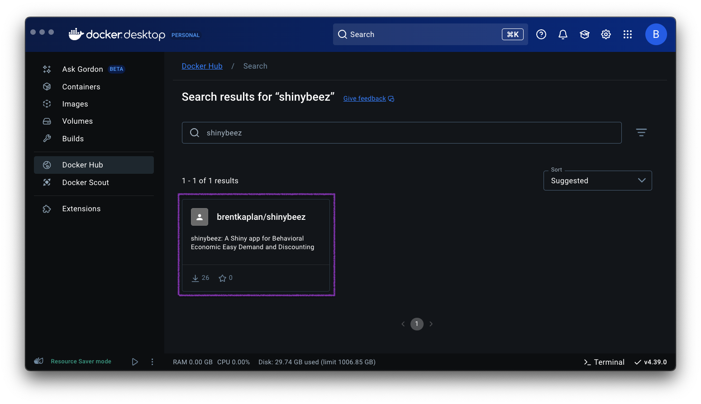
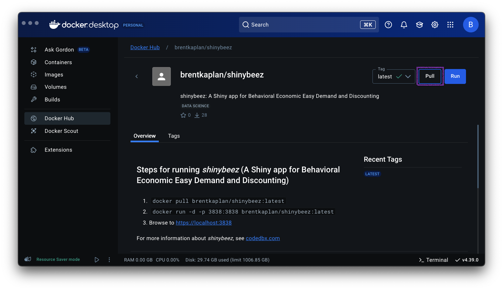
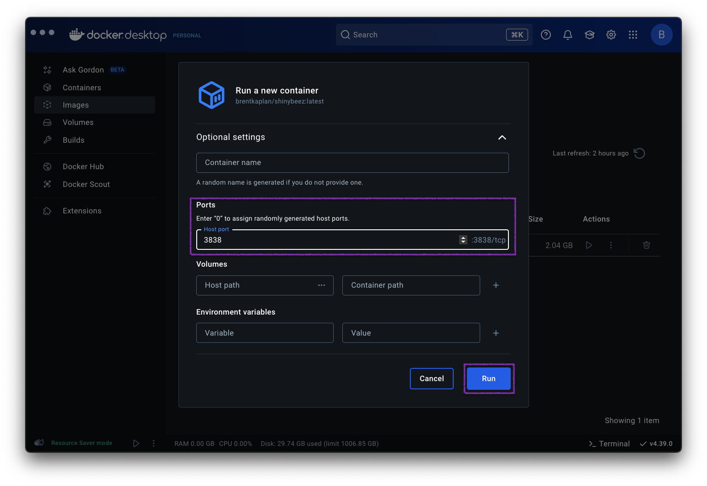

# _shinybeez_ 

_shinybeez_: A Shiny app for Behavioral Economic (be) Easy (ez) Demand and
Discounting.

# Overview

## Citation

If you use any part of _shinybeez_ in your work, please cite it:

**Kaplan, B. A.** & Reed, D. D. (2025). _shinybeez_: A Shiny app for Behavioral
Economic Easy Demand and Discounting. _Journal of the Experimental Analysis of
Behavior, 123_(2), 335-376. doi: [10.1002/jeab.70000](https://doi.org/10.1002/jeab.70000)
{target=\_blank}

<!-- {target=\_blank} -->

## Access and Installation

### Links to _shinybeez_ online

[Live App](https://shinybeez.app){target=\_blank}

[shinyapps.io](https://brentkaplan.shinyapps.io/shinybeez/){target=\_blank}

[GitHub Repository](https://github.com/brentkaplan/shinybeez){target=\_blank}

### Local installation

#### Via Docker

To install _shinybeez_ locally and run it on your own machine, you must first install [Docker](https://www.docker.com/).

1. To start the app via the Docker Desktop program, first click Docker Hub on the left side and search for _shinybeez_.

   

2. Click on the tile and then click "Pull" to download the image.

   

3. Go to "Images" on the left hand side and click the newly downloaded image. Click the ▶ icon under "Actions" to start the app and bring up the options menu.

   

4. Expand the optional settings clicking the ▼. Enter in '3838' in the "Host port" box. Then click "Run".

   

5. Open up your browser of choice and navigate to http://localhost:3838. _shinybeez_ should now be running locally on your machine.

Alternatively, after you have installed Docker on your computer you can run the following commands in your terminal to start the app:

`docker pull brentkaplan/shinybeez:latest`
`docker run -p 3838:3838 brentkaplan/shinybeez:latest`

Then, navigate to http://localhost:3838 in your browser of choice.

#### Via Repository

This Github repsitory contains the code required to run the
app locally. To run the app locally,

- Clone the repository (either `git clone https://github.com/brentkaplan/shinybeez.git` or download the zip file)

- Open new R session in the downloaded folder

- Install the `renv` package using `install.packages("renv")`

- Install all required packages using `renv::install()`

- Run `shiny::runApp()`

## Issues

If you find issues, questions, or feedback, or would like to contribute, please
submit an [issue](https://github.com/brentkaplan/beezdiscounting/issues) or
a pull request, or [email
me](mailto:bkaplan.ku@gmail.com).

# Features

_shinybeez_ is an R Shiny app that allows analyses and visualizations of
behavioral economic demand and discounting data. It relies on the
[`beezdemand`](https://github.com/brentkaplan/beezdemand)
and [`beezdiscounting`](https://github.com/brentkaplan/beezdiscounting)
R packages. In addition to a comprehensive user guide, template files,
and dark mode toggle, _shinybeez_ includes the following features:

#### Demand

- Exportable descriptive table of demand data (mean, median, sd,
  proportion of zeros, etc.)

- Exportable empirical measures of demand data (Intensity, BP0,
  BP1, Omax, Pmax)

- Exportable table of systematic response sets
  (customizable bounce, trend, reversals from zero criteria)

- Exportable table of regression results (Q0, $\alpha$,
  R2, derived and exact Omax, Pmax)

- Exportable plot in APA format of demand data and best-fit lines (customizable
  plot title, axis title text, pseudo-log axes) in png, pdf, svg, and more

- Option to calculate descriptive and regression results by a grouping
  variable

- Choose between the exponential model of demand or the exponentiated
  model of demand

- Select various k values (1-4, individual k, fitted k, empirical range of data)

- Choose between Fit to Group (pooled), Fit to Group (mean), and Two Stage

#### Discounting

- Choose between scoring the 27-Item Monetary Choice Questionnaire (MCQ),
  regression for delay discounting indifference points, the
  5-trial minute task for delay discounting, and the 5-trial minute task for
  probability discounting

- Score the 27-Item MCQ identically to that of the
  27-Item MCQ Automated Scorer in Microsoft Excel
  

##### MCQ

- Choose various methods to impute missing data for the 27-Item MCQ

- Choose between no transformation, log10, transformation, and
  natural log transformation

- Exportable table of MCQ results (overall, small, medium, large, and
  geomean (i.e., composite) k values; overall, small, medium, large, and
  composite consistency; overall, small, medium, and large proportion of
  LDR/LL chosen; and the imputation method)

- Exportable table of summary statistics (mean, sd, sem)

- Exportable table of correlations between small, medium, and large magnitudes

- Exportable table of imputed data when imputing missing data

- Exportable plot in APA format of proportion of SIR/SS choices by k value rank

- Exportable plot in APA format of box plot of k values

##### Delay Discounting Regression

- Exportable table of systematic response sets according to Johnson & Bickel's
  (2008) systematic criteria (thresholds can be customized)

- Choose between Fit to Group (pooled), Fit to Group (mean), and Two Stage

- Choose between Mazur's (1987) hyperbolic model or a simple exponential model

- Exportable table of regression results (including _k_, _R_2, and
  Area Under the Curve)

- Regression results contain standard AUC, log10 AUC, and ordinal AUC

- Exportable plot in APA format of discounting data and best-fit lines
  (customizable plot title, axis title text, log x-axis) in png, pdf, svg, and more

## Example Files

If you would like to test the functionality of _shinybeez_, you can download
some of the example files included in this Github repository:

- [Alcohol Purchase Task data with 50 response sets](https://github.com/brentkaplan/shinybeez/blob/main/app/static/data/examples/shinybeez-ex-apt-50.csv)

- [Alcohol Purchase Task data with 100 response
  sets](https://github.com/brentkaplan/shinybeez/blob/main/app/static/data/examples/shinybeez-ex-apt-100.csv)

- [27-Item Monetary Choice Questionnaire with 100 response sets with missing
  data](https://github.com/brentkaplan/shinybeez/blob/main/app/static/data/examples/shinybeez-ex-mcq-100-missings.csv)

- [Delay Discounting indifference point data with 100 response sets](https://github.com/brentkaplan/shinybeez/blob/main/app/static/data/examples/shinybeez-ex-ip_dd-100.csv)

- [5.5 Trial Delay Discounting from the Qualtrics
  template](https://github.com/brentkaplan/shinybeez/blob/main/app/static/data/examples/shinybeez-ex-five.fivetrial_dd.csv)

- [5.5 Trial Probability Discounting from the Qualtrics
  template](https://github.com/brentkaplan/shinybeez/blob/main/app/static/data/examples/shinybeez-ex-five.fivetrial_pd.csv)

## Template Files

Several template files are included in this Github repository:

- [Demand template file in long
  format](https://github.com/brentkaplan/shinybeez/blob/main/app/static/data/templates/template_demand_long.csv)

- [Demand template file in long format (including grouping
  variable)](https://github.com/brentkaplan/shinybeez/blob/main/app/static/data/templates/template_demand_long-onegroup.csv)

- [Demand template file in wide
  format](https://github.com/brentkaplan/shinybeez/blob/main/app/static/data/templates/template_demand_wide.csv)

- [Demand template file in wide format (including grouping
  variable)](https://github.com/brentkaplan/shinybeez/blob/main/app/static/data/templates/template_demand_wide_onegroup.csv)

- [Discounting template file in long
  format](https://github.com/brentkaplan/shinybeez/blob/main/app/static/data/templates/template_discounting_long.csv)

- [Discounting template file in wide
  format](https://github.com/brentkaplan/shinybeez/blob/main/app/static/data/templates/template_discounting_wide.csv)

- [27-Item Monetary Choice Questionnaire template in long
  format](https://github.com/brentkaplan/shinybeez/blob/main/app/static/data/templates/template_mcq27_long.csv)

- [27-Item Monetary Choice Questionnaire template in wide
  format](https://github.com/brentkaplan/shinybeez/blob/main/app/static/data/templates/template_mcq27_wide.csv)

## Recommended Citations

In addition to using _shinybeez_, we recommend citing the following papers
depending on what features of _shinybeez_ you use:

### Demand

**Underyling R package driving demand functions:**

Kaplan, B. A., Gilroy, S. P., Reed, D. D., Koffarnus, M. N., &
Hursh, S. R. (2019). The R package _beezdemand_: Behavioral Economic
Easy Demand. _Perspectives on Behavior Science,
42_(1), 163-180. <a href='https://doi.org/10.1007/s40614-018-00187-7'>
https://doi.org/10.1007/s40614-018-00187-7</a>

**Systematic criteria:**

Stein, J. S., Koffarnus, M. N., Snider, S. E., Quisenberry, A. J.,
& Bickel, W. K. (2015). Identification and management of
nonsystematic purchase task data: Toward best practice.
_Experimental and Clinical Psychopharmacology, 23_(5),
377-386. <a href='https://doi.org/10.1037/pha0000020'>
https://doi.org/10.1037/pha0000020</a>

**Exponentiated demand equation:**

Koffarnus, M. N., Franck, C. T., Stein, J. S., & Bickel, W. K.
(2015). A modified exponential behavioral economic demand model
to better describe consumption data. _Experimental and Clinical
Psychopharmacology, 23_(6), 504-512.
<a href='https://doi.org/10.1037/pha0000045'>
https://doi.org/10.1037/pha0000045</a>

**Exponential demand equation:**

Hursh, S. R., & Silberberg, A. (2008). Economic demand and
essential value. _Psychological Review, 115_(1),
186-198. <a href='https://doi.org/10.1037/0033-295X.115.1.186'>
https://doi.org/10.1037/0033-295X.115.1.186</a>

 

### Discounting

**Underyling R package driving discounting functions:**

Kaplan, B. A. (2023). _beezdiscounting_: Behavioral
Economic Easy Discounting. R package version 0.3.2,
<a href='https://CRAN.R-project.org/package=beezdiscounting'>
https://CRAN.R-project.org/package=beezdiscounting</a>

**Describing scoring of the 21- and 27-Item Monetary Choice Questionnaires:**

Kaplan, B. A., Amlung, M., Reed, D. D., Jarmolowicz, D. P.,
McKerchar, T. L., & Lemley, S. M. (2016). Automating scoring of
delay discounting for the 21- and 27-Item Monetary Choice
Questionnaires. _The Behavior Analyst, 39_(2),
293-304. <a href='https://doi.org/10.1007/s40614-016-0070-9'>
https://doi.org/10.1007/s40614-016-0070-9</a>

**Seminal article introducing the 27-Item Monetary Choice Questionnaire:**

Kirby, K. N., Petry, N. M., & Bickel, W. K. (1999).
Heroin addicts have higher discount rates for delayed rewards
than non-drug-using controls. _Journal of Experimental
Psychology: General, 128_(1), 78-87.
<a href='https://doi.org/10.1037//0096-3445.128.1.78'>
https://doi.org/10.1037//0096-3445.128.1.78</a>

**Imputing missing data in the 27-Item Monetary Choice Questionnaire:**

Yeh, Y.-H., Tegge, A. N., Freitas-Lemos, R., Myerson, J., Green, L.,
& Bickel, W. K. (2023). Discounting of delayed rewards: Missing
data imputation for the 21- and 27-item monetary choice
questionnaires. _PLOS ONE, 18_(10),
e0292258. <a href='https://doi.org/10.1371/journal.pone.0292258'>
https://doi.org/10.1371/journal.pone.0292258</a>

**Systematic criteria:**

Johnson, M. W., & Bickel, W. K. (2008). An algorithm for
identifying nonsystematic delay-discounting data. <em>Experimental
and Clinical Psychopharmacology, 16</em>(3), 264-274.
<a href='https://doi.org/10.1037/1064-1297.16.3.264'>
https://doi.org/10.1037/1064-1297.16.3.264</a>

**Mazur's hyperbolic discounting model:**

Mazur, J. E. (1987). An adjusting procedure for studying delayed
reinforcement. In M. L. Commons, J. E. Mazur, J. A. Nevin, &
H. Rachlin (Eds.), <em>The effect of delay and of intervening
events on reinforcement value</em> (pp. 55-73). Lawrence Erlbaum
Associates, Inc.

**Variations on Area Under the Curve (AUC):**

Borges, A. M., Kuang, J., Milhorn, H., & Yi, R. (2016). An
alternative approach to calculating Area-Under-the-Curve (AUC)
in delay discounting research. <em>Journal of the Experimental
Analysis of Behavior, 106</em>, 145-155.
<a href='https://doi.org/10.1002/jeab.219'>
https://doi.org/10.1002/jeab.219</a>

**Minute discounting task:**

Koffarnus, M. N., & Bickel, W. K. (2014). A 5-trial adjusting
delay discounting task: Accurate discount rates in less than 60
seconds. _Experimental and Clinical Psychopharmacology,
22_(3), 222-228. <a href='https://doi.org/10.1037/a0035973'>
https://doi.org/10.1037/a0035973</a>

Koffarnus, M. N., Rzeszutek, M. J., & Kaplan, B. A. (2021).
Additional discounting rates in less than one minute: Task variants
for probability and a wider range of delays. <a href='https://doi.org/10.13140/RG.2.2.31281.92000'>
https://doi.org/10.13140/RG.2.2.31281.92000</a>

Koffarnus, M. N., Kaplan, B. A., & Stein, J. S. (2017). User guide
for Qualtrics minute discounting template.
<a href='https://doi.org/10.13140/RG.2.2.26495.79527'>
https://doi.org/10.13140/RG.2.2.26495.79527</a>
